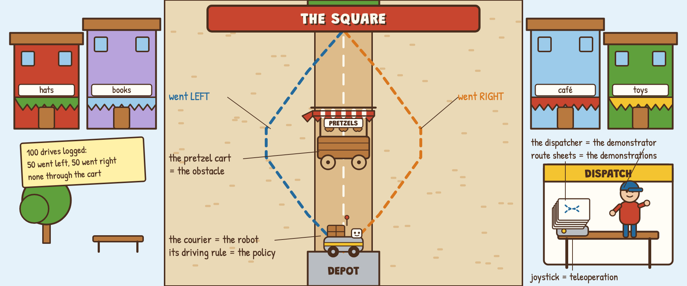
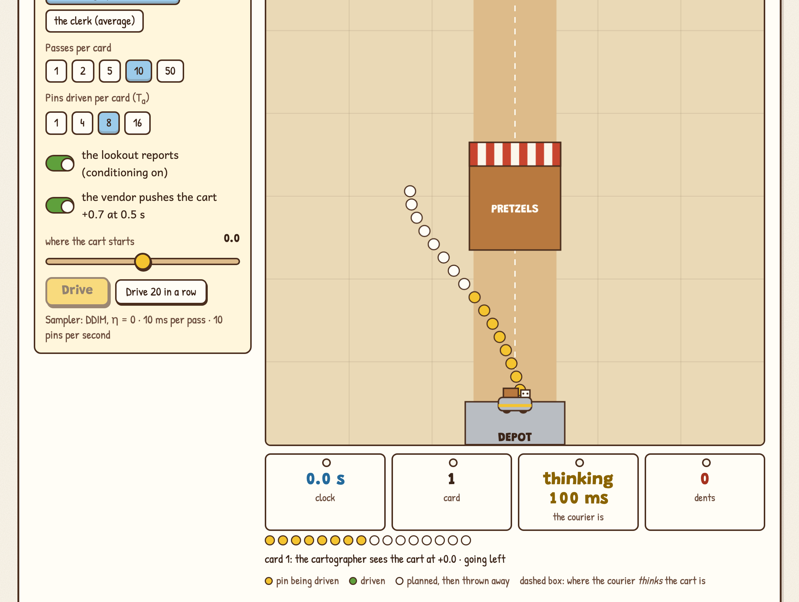
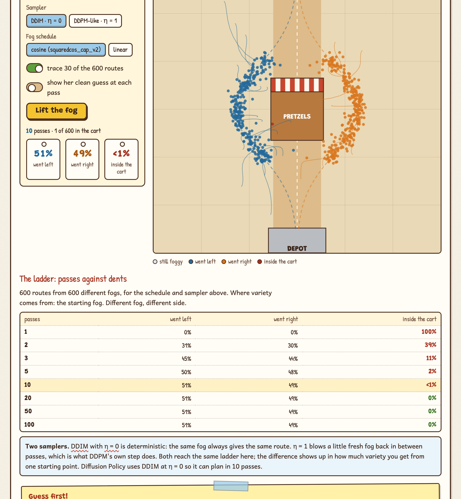

# Fork in the Road

**A hands-on lab for why robots use diffusion to choose actions.** Fog a route map, lift the fog in passes, and watch a regression policy drive into the cart while a diffusion policy goes around it. The real DDPM and DDIM math from Unit 1 of the Hugging Face Diffusion Models Course, running in your browser, pointed at the reason robotics cares.

**Play it: https://bakulbadwal.github.io/fork-in-the-road/**

A delivery robot learns from a hundred human drives around a pretzel cart. Half went left, half went right. The **courier** is the robot and its driving rule is the policy; the dispatcher's **route sheets** are the demonstrations; the **cart** is the reason they fork. A **clerk who averages the sheets** is a regression policy, and he drives straight into the cart. **Fog** is noise, the **cartographer** who redraws a foggy map is the denoiser, the **lookout's report** is the observation, and the **waypoint card** of 16 pins is an action chunk. Hold that picture and Diffusion Policy follows.

## What's inside

| Step | You play with | What clicks |
|---|---|---|
| **0 · The Square** | Log the dispatcher's drives one at a time or all 100; drive the clerk's average route | A model trained with squared error answers a fork with the average, and the average of left and right is the cart. More data doesn't change it |
| **1 · Fog Rolls In** | A t slider from 0 to 999 over 600 logged positions; the linear and cosine schedules; the arithmetic for one dot with live numbers | x_t = √ᾱ·x₀ + √(1−ᾱ)·ε is a crossfader set by the schedule. Cosine is half fog at t ≈ 500, linear at t ≈ 260 |
| **2 · The Cartographer** | The exact best guess x̂₀ for every foggy dot at every t, with a pointer from each dot; the ε ↔ x̂₀ conversion worked for one dot | From pure fog the least-wrong single guess is the average of every route: the smudge. Predicting the noise and predicting the map are the same prediction |
| **3 · Fog Lifts in Passes** | Denoise 600 routes from 600 fogs in 1, 2, 3, 5, 10 or 50 passes; DDIM η = 0 vs DDPM-like η = 1; traces and per-pass guesses; a live ladder of passes against dents | 1 pass: 100% in the cart. 5: 2%. 10: 0%. Each guess starts from a map that already leans, so the route commits. With the linear schedule two passes are 94% in the cart |
| **4 · The Stopwatch** | Milliseconds per pass, a 5–50 Hz control loop, and the ladder with a budget line | 10 ms a pass and 100 ms a card is 10 DDIM passes, which are already enough. DDPM's 1,000 would take 10 s |
| **5 · The Lookout** | Park the cart anywhere; draw 600 routes with the report and 600 blindfolded, side by side | Conditioning: with the observation the routes go around today's cart; without it, around where it used to be, and 28% hit it at +1.0. FiLM vs Unit 2's channel concatenation |
| **6 · Pin 16, Drive 8** | The courier drives: cartographer or clerk, 1–50 passes, 1–16 pins per card, lookout on or off, a vendor who pushes the cart mid-drive; 20-drive fleets with dents, side flips and time | Receding-horizon control on a diffusion sampler. Re-plan every pin and it dithers (1.9 flips a drive); drive 8 and it commits; drive all 16 and it can't react; blindfold it and half the drives dent |
| **★ Review Board** | Three incident reports: the straight-liner, the ditherer, the slowpoke. Run the rule, pick a fix, re-drive 20 times, name the cause | The tempting wrong fixes (more data, more passes, a shorter card, a faster motor) fail for the reason the step taught |
| **✓ Field Test** | Eight questions answered by operating the widgets | Proof it stuck |

Each step has predict-then-reveal questions and a "say it out loud" line that unlocks once you've played. Every term has a tooltip with its plain meaning and its square equivalent. Progress is saved in your browser.

## Why another diffusion demo

The interactive diffusion explainers are about images or about the geometry, and the one diffusion-policy lab drives a single-mode task. This lab is about the fork: the multi-modal action distribution that is the reason Diffusion Policy exists. I checked the neighbours against their own pages on 2026-09-25.

| | **Fork in the Road** | [Cart-Pole Diffusion](https://github.com/tinmanlab/cartpole-diffusion) | [Diffusion Explorer](https://github.com/helblazer811/Diffusion-Explorer) | [Diffusion Explainer](https://poloclub.github.io/diffusion-explainer/) |
|---|:-:|:-:|:-:|:-:|
| The fork: multi-modal demonstrations against an MSE baseline, every step | ✓ | — (balancing is single-mode; no baseline) | draw any 2-D distribution; no policy baseline | — |
| A real trained denoiser | — (the exact Bayes-optimal denoiser for the toy data; nothing is trained) | ✓ | ✓ trains in the browser | pretrained Stable Diffusion |
| Forward process with two schedules, live | ✓ | timestep slider | ✓ | timestep controller |
| DDIM vs DDPM (η) and the schedule's effect on few-pass sampling | ✓ | DDIM only | flow matching vs score matching | — |
| Passes against a latency budget | ✓ | — | — | — |
| Conditioning on an observation, with a blindfolded baseline | ✓ | ✓ same noise, different observation | — | text prompt |
| Receding-horizon execution with re-planning and a moving obstacle | ✓ | ✓ 16 predict, 4 execute | — | — |
| Guided lessons with predict-then-check, a capstone and a graded test | ✓ (16 predictions, 3 cases, 8 questions) | a 6-step guided cycle | — | — |
| Tied to the Hugging Face course notebooks | ✓ | — | — | — |

Cart-Pole Diffusion is the one to open next if you want to see a *learned* denoiser drive a plant in real time; Diffusion Explorer is the one for watching a real model train on a distribution you drew.

## Run it

Play it live at the link above, or open `index.html` in a browser. There's no build step, no dependencies, and nothing to install. `?run=lift#/s3` opens step 3 with the fog already lifted; `?run=drive#/s6` opens step 6 with a drive already run (cart pushed, lookout on).

## What's exact and what's a model

- **Exact, real math:** the forward process x_t = √ᾱ·x₀ + √(1−ᾱ)·ε; the linear and cosine (`squaredcos_cap_v2`) schedules built the way diffusers builds them; the denoiser, which is the exact Bayes posterior mean E[x₀ | x_t] for the toy demonstration distribution, what a perfectly trained noise-prediction network converges to, with no training error; the ε ↔ x̂₀ conversion; DDIM sampling with η (Song et al., 2021, eq. 12); the mixture mean as the squared-error-optimal single guess; every number quoted from the Diffusion Policy paper.
- **Teaching models, labelled on the page:**
  - The square, the two demonstrated routes, and how the demonstrators' choice of side leans with the courier's position are hand-designed.
  - The courier teleports between checkpoints ten times a second and stands still while a card is drawn; the vendor's push and pacing are one-number toys.
  - No network is trained here.
- **The directions are real; the courier isn't a real robot.** Nothing here predicts how a real Diffusion Policy run behaves.

Every number the build was checked against is in [`ACCEPTANCE.md`](ACCEPTANCE.md), and `node tests/check.js` prints them. Every demo is seeded, so it's the same for everyone.

## Sources

- [Hugging Face Diffusion Models Course, Unit 1](https://huggingface.co/learn/diffusion-course/unit1/1): both notebooks (Introduction to Diffusers; Diffusion Models from Scratch) are the spine
- Ho, Jain & Abbeel, *Denoising Diffusion Probabilistic Models* (2020) · Song, Meng & Ermon, *Denoising Diffusion Implicit Models* (2021) · Nichol & Dhariwal, *Improved Denoising Diffusion Probabilistic Models* (2021), the cosine schedule
- Chi et al., [*Diffusion Policy: Visuomotor Policy Learning via Action Diffusion*](https://arxiv.org/abs/2303.04137) (2023): T_p = 16, T_a = 8, T_o = 2, DDIM with 100 training and 10 inference iterations at 0.1 s on an RTX 3080, FiLM conditioning, the square cosine schedule, the 46.9% figure
- [lerobot/diffusion_pusht](https://huggingface.co/lerobot/diffusion_pusht): a real Diffusion Policy on the Push-T task, the natural next step

## Files

| File | Role |
|---|---|
| `index.html` | All teaching copy and page structure |
| `js/core.js` | The math: pure functions, exposed as `window.FR` |
| `js/sim.js` | The square, the demonstrations, the waypoint card and the drive loop: seeded, deterministic |
| `js/app.js` | Wires controls to the math and draws the maps |
| `js/glossary.js` | Tooltip definitions |
| `js/art.js` | The eight hand-built SVG scenes and the icons |
| `tests/check.js` | Prints every number in `ACCEPTANCE.md` (`node tests/check.js`) |
| `PRODUCT.md`, `DESIGN.md` | Product brief and design notes |

A sibling of [Inference Kitchen](https://github.com/bakulbadwal/inference-kitchen) (serving), [Policy Pond](https://github.com/bakulbadwal/policy-pond) (reinforcement learning) and [Arm Playground](https://github.com/bakulbadwal/arm-playground) (kinematics and control). Built by [Bakul Badwal](https://github.com/bakulbadwal) (UVA Darden MBA '27) with Claude Code, as an unofficial companion to the Hugging Face Diffusion Models Course. Not affiliated with Hugging Face.

## License

MIT
